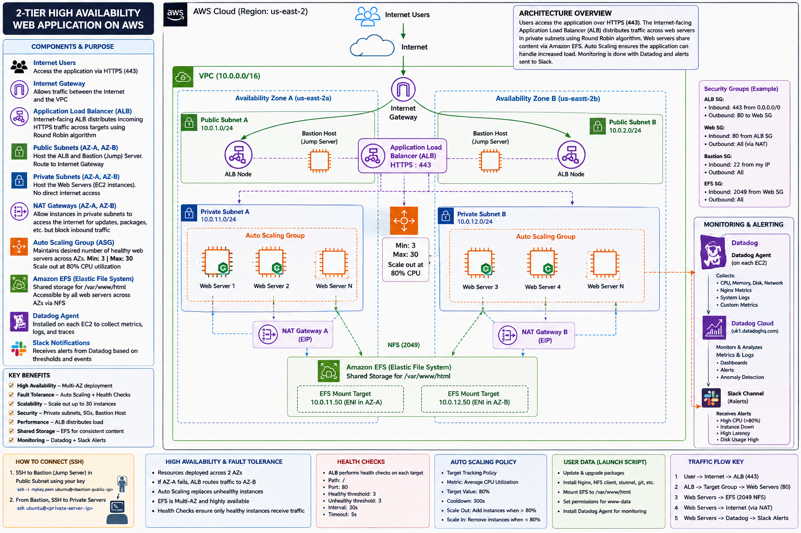

# Highly Available 2-Tier Web Application on AWS

## Project Overview

This project documents the design and deployment of a highly available two-tier web application architecture on Amazon Web Services (AWS).

The infrastructure follows cloud architecture best practices by separating Internet-facing resources from application servers, distributing workloads across multiple Availability Zones, and automating server provisioning with Auto Scaling.

The project combines networking, Linux administration, storage, monitoring, and automation into one production-style deployment.

---

## Architecture Objectives

- High Availability across multiple Availability Zones
- Fault Tolerance through redundant resources
- Elastic Scalability using Auto Scaling
- Secure network segmentation
- Shared storage with Amazon EFS
- Continuous monitoring with Datadog
- Alert notifications through Slack

---

## AWS Services Used

- Amazon VPC
- Public Subnets
- Private Subnets
- Internet Gateway
- NAT Gateway
- EC2
- Application Load Balancer
- Target Groups
- Auto Scaling Groups
- Launch Templates
- Amazon Elastic File System (EFS)
- Security Groups
- Datadog
- Slack

---

## Linux Technologies Used

- Ubuntu
- Bash
- SSH
- Nginx
- Systemd
- NFS
- apt
- mount
- systemctl

---

## Project Workflow

Internet Users

↓

Application Load Balancer (HTTPS 443)

↓

Target Group

↓

Auto Scaling Group

↓

Private EC2 Web Servers

↓

Amazon EFS

↓

Datadog Agent

↓

Datadog Cloud

↓

Slack Alerts

---

## Skills Demonstrated

✔ AWS Networking

✔ Linux Administration

✔ Cloud Storage

✔ High Availability

✔ Fault Tolerance

✔ Auto Scaling

✔ Infrastructure Automation

✔ Monitoring & Alerting

✔ Cloud Security

✔ Bash Scripting

---

## Repository Structure
# Highly Available Web Application on AWS

## Architecture Diagram

## DevOps Integration

This project is maintained using Git and GitHub as part of my DevOps learning journey.

The repository provides version-controlled documentation and infrastructure-related configuration for the AWS two-tier architecture.